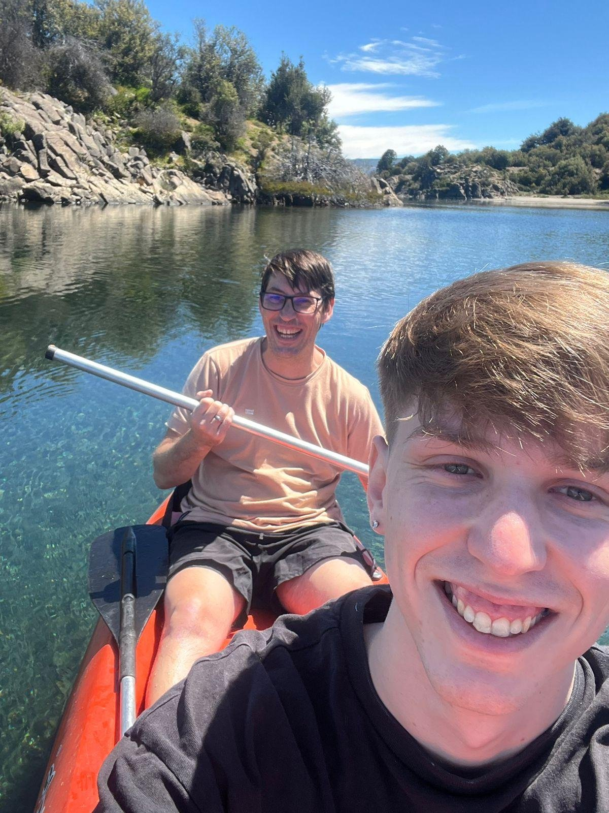

# Gabriel Ernesto Polverini

Hola, me llamo **Gabriel** y este es mi tercer cuatrimestre en la carrera — aunque no soy exactamente nuevo en el mundo de la programación.

Llevo más de **20 años trabajando en IT**, y hace un tiempo estuve muy cerca de recibirme como Ingeniero en Informática en la Universidad Nacional de La Matanza (**UNLaM**). La vida, el trabajo y las oportunidades que fueron surgiendo me llevaron por otro camino. Hoy siento que es el momento de cerrar ese círculo y tener el título que representa lo que ya sé y hago.

Pero lo que realmente me terminó de convencer de anotarme fue algo más personal: **estoy cursando esta carrera junto a mi hijo**. Esa es la razón más importante de todas.

---

## Mi camino en IT

Empecé como **desarrollador Jr.**, fui creciendo a **desarrollador Senior**, después asumí el rol de **Tech Lead**, y hoy me desempeño como **Solution Specialist** en **Claro**, donde me especializo en todo lo relacionado con **DRM (Digital Rights Management)**: protección de contenidos digitales, licencias y distribución segura de medios en plataformas de streaming.

Dentro de la industria, lo que más me apasiona es la **arquitectura de software** y el **desarrollo**. Me gusta pensar en cómo se construyen las cosas desde adentro: qué decisiones de diseño hacen que un sistema escale, sea mantenible y tenga sentido a largo plazo.

---

## Fuera del trabajo

- ⚽ **Fútbol**: juego tres veces por semana. Es mi momento de desconectar, moverme y compartir con otros.
- 🐕 **Mis perros**: tengo cuatro. Para mí son familia.
- 🛶 **Aire libre**: siempre que puedo, prefiero estar afuera. La foto lo dice todo.

---

## ¿Por qué esta carrera, ahora?

Porque si bien ya cuento con los conocimientos desarrollados, un título es una forma concreta de validarlos. Y porque compartir este proceso con mi hijo le da un significado completamente distinto.

> *"Veinte años en IT me enseñaron que siempre hay algo nuevo que aprender. Ahora lo aprendo al lado de mi hijo."*
